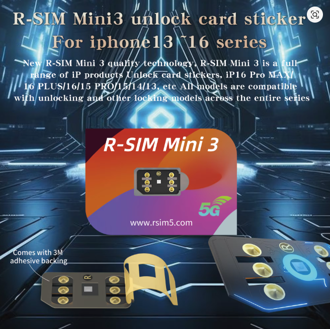
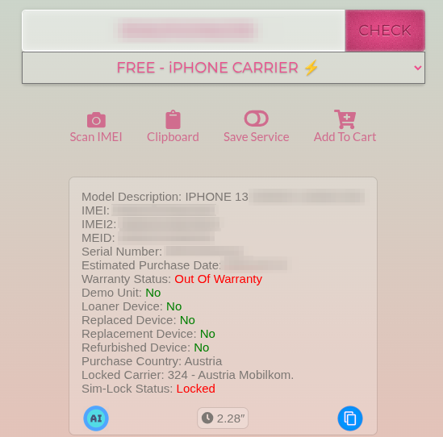
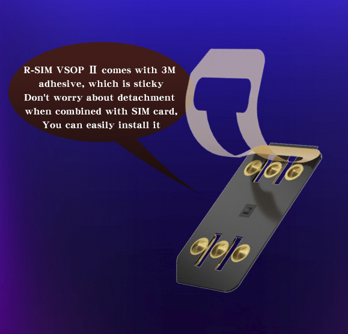
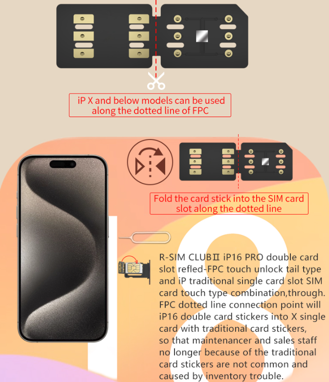
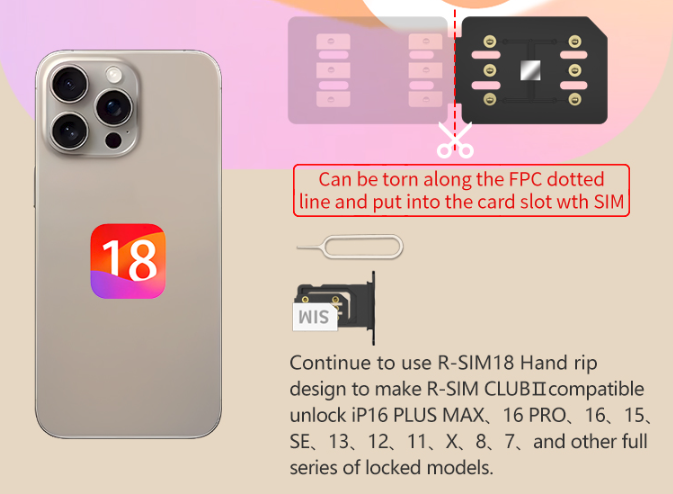

# First thing first
1. This guide is only for iPhone's
2. The best way and official way to unlocking your iphone sim is to ask to your iphone carrier to unlock it:
   -  find the carrier your iphone is locked to, if you dont know the carrier go to [Finding your iPhone carrier](https://github.com/dani-dot/iphone-sim-unlock/tree/main?tab=readme-ov-file#finding-your-iphone-carrier) chapter for instructions
   -  search them up on google to find their info, call them, email them, or go to a local store, and explain your situation and that you want to unlock it
   -  pray they do
   -  if they ask for too much money or they refuse to unlock it , this guide is for you

3. To my knowledge there is no software or website for unlocking that works or its real , 99% of them are scams
4. The only unofficial way to sim unlock your iphone is through hardware unlocking (simunlock chips/cards) like Heicard, Rsim or others. In this guide im going to talk about rsim because its the only one i have used
5. Heicard, Rsim or other such cards only work for physical sim devices (physical sim + esim or dual physical sim) and you can only use the physical sim. I have seen some esim unlock products but i havent tested them, some on them require esim to physical sim conversion
# R-SIM

  
  

### What is R-SIM?
R-SIM is a thin card/chip that wraps around (or sits on top) your sim card to unlock it, some newer versions have glue on them to stick to your sim card

### How does it work?
From my understanding it uses differt exploits to trick your phone, for example : if your iphone is sim locked in AT&T (can only use AT&T sim cards) and you have a T-Mobile sim card, r-sim tricks your phone into thinking that your T-Mobile sim card is an AT&T one

### How expensive?
An R-SIM chip is around +-5 euro , but the whole unlock might end up around 5/20 euro (depends on the unlock method), so its a cheap option

### How effectiv?
You could get a perfect device or u might encounter some problems , depending on the iphone model , ios version , carrier , unlock method and R-SIM chip version. So there no way to say 100% what works and what doesnt. ***!! R-SIM uses your phones power and you could get less battery out of your device*** 

### Where do i buy one?
You will find a bunch of sellers on ebay , alliexpress or even amazon. Ofc  there are other websites aswell just search for them

## First steps with R-SIM
1. Finding your iPhone carrier
2. Finding your carrier code
3. Checking baseband (Qualcomm Or Intel)
### Finding your iPhone carrier:
There are a lot of websites that offer iphone carrier check services, just search on google for "iphone carrier check" and find one that suits you. I personaly used https://sickw.com because its free, after entering your imei/serial no. you gonno get a result something like this:
   

    

Make sure you take note of "Purchase Country" "Locked Carrier", for me it was Austria and  Austria Mobilkom, note this down somewhere if u forget quickly

### Finding your carrier code:
   1. [Open](https://www.rsim5.com/bottomlink.php?id=3) and search for your "Purchase Country" ( Austria for me ) ; if the link is down ,download [this](assests/httpfiles/rsimwebsite.html) and open it in your browser
   2. At your "Purchase Country" you gonna see all the "Carriers" in that respectiv country, search for your Carrier (Austria Mobilkom/A1 Telekom) , some carriers change their name or get bought by other carriers , so make a quick info search on google if you dont find yours.
   3. ***!! Attention !!***  The webpage is very long and detailed, if you dont find your carrier be sure to scroll through all of it
   4. At your Carrier you gonno see all the carrier codes (for example : "5050134" ; "2343000  GID1:C3" ; "2040438 GID2 A7" ) , be sure to take note of all of them ( you might have multiple codes ) 
   5. ***INFORMATION*** not all carrier codes have a GID1 or GID2 but it yours has one be sure to take note of it

### Checking baseband (Qualcomm Or Intel):
   1. Intel baseband:（XR/Xs/XsMax/SE2/11/11Pro/11ProMax ）
   2. Qualcomm baseband:（SE3/12/12Mini/12Pro/12ProMax/13/13Mini/13Pro/13ProMax/14/14Pro/14ProMax and newer ）
   3. Others (7/7Plus/8/8Plus/X ) check here:
      - Call *#06# or check Settings-General-About
      - its Qualcomm baseband if have a MEID number , Intel baseband if cannot see a MEID number
    

## Second step with R-SIM
   1. How to put r-sim in the sim slot 
   2. Menu pop up
   3. Unlock methods

### How to put r-sim in the sim slot
If you have r-sim with adhesive (double sided tape) its easy, just take tape cover off and glue it to your sim card like in the [video](https://youtu.be/OO6vBY41mos?si=UrpKqLmwq_muHVJS&t=48), and put it in your sim card like normaly
   

    

If you have r-sim without adhesive, check sim orientation, if the sim golden pads are up you will need to fold the r-sim around your sim card [video here](https://youtu.be/Mt2_vMGSWAU?si=qAHHE6JDJFfF9toH&t=545). If the sim golden pads are down you need to cut the r-sim in  two, put the chip side in the sim lot and over it your sim [video here](https://youtu.be/Mt2_vMGSWAU?si=vqRbYcPAVdWdn0z6&t=125) (just follow the how to mount your r-sim instructions, the iccid stuff most likly wont work)

  
  

### Menu pop up

 When you plug in your sim card with r-sim ,the r-sim menu should pop up, here you can choose your **Unlock method**. If the menu doesnt pop up:
 1. Go to settings > Cellular > SIM Application > usally first button (something like Set sim , Unlock , Menu) after this you can follow **Unlock method**
 2. If you cannot go to SIM Application or Cellular, go to Phone (or press Emergency Call )and call the following numbers till the menu pops up:
    - "*" or "**"
    - "#" or "##"
    - "* 505 * 7672 * 00 #"
    - "* 5005 * 7672 * 0 #"
    - "* 5005 * 7672 * 003"
 3. **Advice** always go slowly when trying to pop the r-sim menu or doing any settings related to r-sim , this is a small chip , its not super fast so sometimes you goto wait

### Unlock methods

1. **SED/MEP Mode** :
    - Only works on ***dual physical*** sim iPhone 13 to 17 (Qualcomm baseband), this is the chinese version iPhone
    - If you have golbal version iphone (physical sim + esim) it requiers to convert from **physical sim + esim** to **dual physical sim** by changing the sim slot reader with a china version sim slot reader and it works (this requires buying an dual sim sim slot reader and opening the phone up , so its not for everyone) [video here](https://www.youtube.com/watch?v=JXBMpGrUZL8), some iphone models do require board level soldering like in [this video](https://www.youtube.com/watch?v=PIwnEh592zY&t=166s)
    - It works the best out of all of them , its plug and play , auto loading ipcc , almost 100% unlocked experience 
    - You need the newest version of R-SIM like R-Sim MINI 3, R-SIM VSOP2 , R-SIM 19 Pro (you need this one if you use two physical sims)
    - [Video instruction](https://www.youtube.com/shorts/5hwT5uGHqmc), quite simple
    - On the chinese markets there are some special **dual physical** sim card readers integrated with some sort of r-sim chip, this is the 100% unlocked experience, you change the sim slot, plug in your sim card and it just works (without an r-sim chip over your sim card because the special **dual physical** sim card reader has it integrated)
2. **eSim(QPE) Mode**：
     - Works with iPhone 12-16 (physical sim + esim) (Qualcomm baseband)
     - You need R-SIM CLUB2 or newer (like R-Sim MINI 3, R-SIM VSOP2 ) and to buy a R-SIM Ecode (its around 10 euro)
     - Instruction [video here](https://www.youtube.com/watch?v=Rd3qJ0Q6etE) and [written here](https://www.rsim5.com/instructionview.php?id=86)
     - Requiers loading ipcc [video here](https://www.youtube.com/watch?v=n_sk35tVXDQ) , ipcc loading doesnt work for me (it might work for you tho)
     - Advantage: Very stable unlock from my experience , never lost signal and almost never got the activating iphone message, not even after restart
     - Disadvantage: you need to buy a R-SIM Ecode , and im not sure if you can reuse that e-sim if u delete it, or if you need to buy another one.

3. **QPE Mode/For Qualcom** :
     - Works with iPhone 12-17 (physical sim + esim) (Qualcomm baseband)
     - Instructions: Select unlock mode For Qualcom ; Select input imsi ; Write your carrier codes and hit send ; write GID1: (if you dont have one just hit send) ; write GID2:  (if you dont have one just hit send) ; Select accept and wait for signal to work
     - Requiers loading ipcc [video here](https://www.youtube.com/watch?v=n_sk35tVXDQ) ,ipcc loading doesnt work for me (it might work for you tho)
     - Advantage: stable unlock from my experience
     - Disadvantage: i got the activating iphone message after restart and have to wait a bit till the r-sim kicks in (eSim(QPE) Mode is better)
4. **INTEL Mode(XR-11Prm)** :
     - Works with iPhone XR-11Prm (Intel baseband)
     - Instructions: Select unlock mode for Intel Mode(XR-11Prm) ; Select input imsi ; Write your carrier codes and hit send ; write GID1: (if you dont have one just hit send) send; write GID2:  (if you dont have one just hit send) send ; Select accept and wait for signal to work
     - Requiers loading ipcc [video here](https://www.youtube.com/watch?v=n_sk35tVXDQ) , ipcc loading worked perfectly on my iPhone SE 2020 ios 26
     - Advantage: very stable unlock from my experience, sms worked perfectly
     - Disadvantage: activating iphone message after restart and have to wait a bit till the r-sim kicks in
5. **INTEL Mode(7-X)** :
     -  Works with iPhone 7-X (Intel baseband)
     -  Instructions: Select unlock mode for Intel Mode(7-X) ; Select input imsi ; Write your carrier codes and hit send ; write GID1: (if you dont have one just hit send) send; write GID2:  (if you dont have one just hit send) send ; Select accept and wait for signal to work
     -  Requiers loading ipcc [video here](https://www.youtube.com/watch?v=n_sk35tVXDQ) , i havent tried it out on my iPhone 7 plus
     -  Disadvantage: from my experience on my iPhone 7 plus the activating iphone message come up a lot ,  again this might not be the case for you
     -  
6. **ICCID MODE** :
     - From my knowledge this mode was patched by apple, im not 100% but from all the iccid codes i tried out ,none of them worked
     - Instructions: Select unlock mode ICCID PERFECT MODE ; Write your ICCID ( u used to find these on the internet ) ; Select accept and wait for signal to work
     - I dont have much experience for this unlock method but from all i tired it didnt work
7. **Traditional Mode/TMSI Mode** :
     - I havent tired it out but from what i read its very unstable unlock ,  again this might not be the case for you
     - Instructions: Select unlock TMSI Mode/Traditional Mode 2G/3G GSM TMSI 6S/6SP  Select input imsi ; Write your carrier codes and hit send ; write GID1: (if you dont have one just hit send) send; write GID2:  (if you dont have one just hit send) send ; Select accept and wait for signal to work
8. **What is IPCC**
     - Ipcc is not an unlock method, it reads your sim card carrier settings and applies them to make the unlock more stable and better (like activating 5g network or other carrier specific settings)
9. 

### Problems

1. loading ipcc not working on some devices or ios verion (or it might be specific to me), this mean no 5G or other carrier specific settings
2. can receive sms but cant send, on some devices or ios verion (or it might be a carrier specific bug)
3. missing calls or not calling, i had most of this problems with **INTEL Mode(7-X)** and a little bit with **INTEL Mode(XR-11Prm)**, so yeah the newer Qualcomm baseband iphones are more stable
