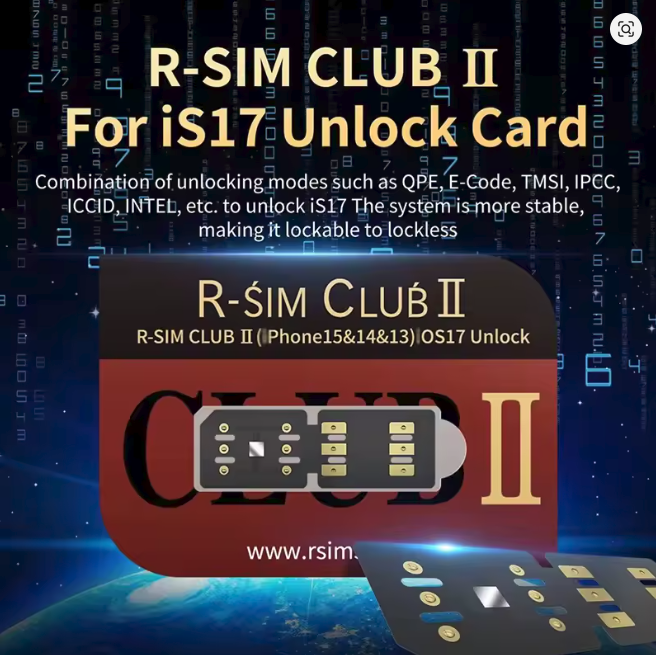

# First thing first
1. This guide is only for iPhone's
2. The best way and official way to unlocking your iphone sim is to ask to your iphone carrier to unlock it:
   -  find the carrier your iphone is locked to, if you dont know the carrier go to scroll lower to Find Carrier chapter for instructions
   -  search them up on google to find their info, call them, email them, or go to a local store, and explain your situation and that you want to unlock it
   -  pray they do
   -  if they ask for too much money or they refuse to unlock it , this guide is for you

3. To my knowledge there is no software or website for unlocking that works or its real , 99% of them are scams
4. The only unofficial way to sim unlock your iphone is through hardware unlocking (simunlock chips/cards) like Heicard, Rsim or others. In this guide im going to talk about rsim because its the only one i have used
5. Heicard, Rsim or other such cards only work for physical sim devices (physical sim + esim or dual physical sim) and you can only use the physical sim. I have seen some esim unlock products but i havent tested them
# R-SIM

c

### What is R-SIM?
R-SIM is a thin card/chip that wraps around (or sits on top) your sim card to unlock it, some newer versions have glue on them to stick to your sim card

### How does it work?
From my understanding it uses differt exploits to trick your phone, for example : if your iphone is sim locked in AT&T (can only use AT&T sim cards) and you have a T-Mobile sim card, r-sim tricks your phone into thinking that your T-Mobile sim card is an AT&T one

### How expensive?
An R-SIM chip is around +-5 euro , but the whole unlock might end up around 5/20 euro (depends on the unlock method), so its a cheap option

### How effectiv?
You could get a perfect device or u might encounter some problems , depending on the iphone model , ios version , carrier , unlock method and R-SIM chip version. So there no way to say 100% what works and what doesnt. !! R-SIM uses your phones power and you could get less battery out of your device

### Where do i buy one?
You will find a bunch of sellers on ebay , alliexpress or even amazon. Ofc  there are other websites aswell just search for them

# Unlocking with R-SIM
First steps to unlocking are :
1. Finding your iPhone carrier and carrier code
2. Finding the best unlock method for you
## Finding your iPhone carrier and code:
   1. There are a lot of websites that offer iphone carrier check services, just search on google for "iphone carrier check" and find one that suits you. I personaly used https://sickw.com because its free, after entering your imei/serial no. you gonno get a result something like this:
   

    

   2. ok
   3. do
   
